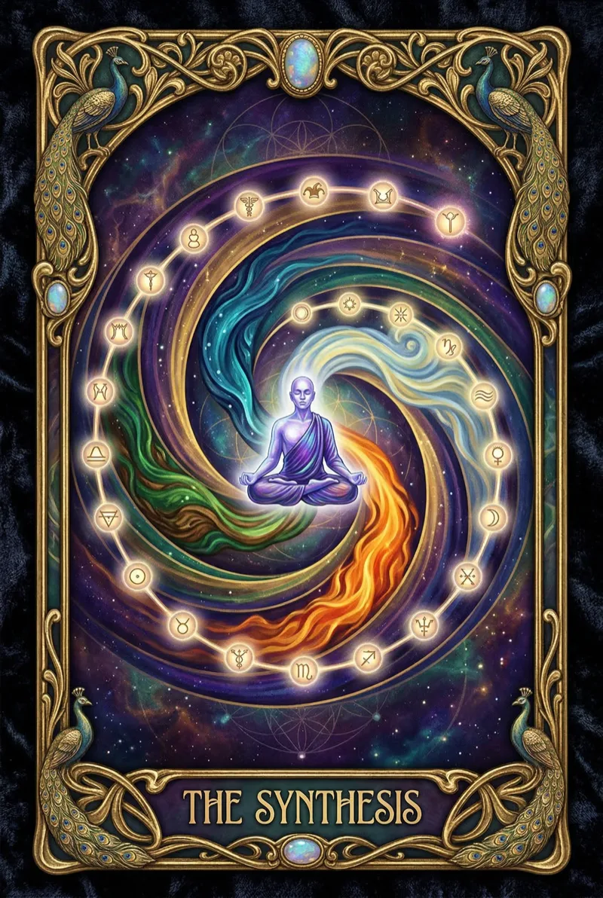

<p align="center">
  
</p>

<h1 align="center">Synchronocities</h1>

<p align="center">
  <em>A 55-day mythic journey through Thailand, told as a depth-scrolling tarot gallery.</em>
</p>

<p align="center">
  <a href="https://synchronocities.tryambakam.com">Live Site</a> &middot;
  <a href="https://github.com/Sheshiyer/synchronocities-blog/milestone/1">Milestone 1</a> &middot;
  <a href="https://github.com/Sheshiyer/synchronocities-blog/milestone/2">Milestone 2</a>
</p>

<p align="center">
  
  
  
  
  
  
</p>

---

## The Experience

Content lives on the **Z-axis** — not a feed. The homepage is a Three.js depth gallery where each blog post is a floating tarot card plane. Scroll through depth, click to read. No pagination, no sidebar, no archive page.

Each of the 20 posts is a unique step on the spiral:

```
0   The Fool Before the Leap        Mumbai → Shenzhen
    Deep-Trench Forge               Shenzhen
    Who TF is Shesh                 Bangalore → Bangkok
XVI The Tower Speaks in Richter     Bangkok (Room 44 / Building 555)
    Arrival in Room 3               Bangkok
    Timelessness Dilation           Bangkok
    The Sword of Speech             Bangkok
    Ports of Call                   Bangkok
    The Fool's Satchel              Bangkok
    Bangkok Initiation              Bangkok → Koh Samui
XVII The Star Names You             Koh Samui (Songkran)
XVIII The Moon Refracts Everything  Koh Phangan (Thong Nai Pan)
IX  The Hermit: 72 Hours           Bangkok (Noble 33, Room 95)
XIV Temperance Compresses           Chiang Mai (Blue Dream, Room 23)
    Circle over Inanna              Bangkok (Circle Tower, Room 3902)
XX  Judgement: Re-collection        Pai (Shaya Suandoi, Room 10)
XXI The Seventh Floor               Chiang Mai (Y Residence, Room 707)
    The Earthquake Goodbye          Bangkok (Rhythm Sukhumvit)
XXI The Universe: Four Creatures    Bangkok (return — spiral complete)
    Master Synthesis                Thailand (55-day integration)
```

## What Makes It Different

**Each post is its own world.** Not a template with different colors — genuinely different layouts:

| Layout | Card | Visual Character |
|--------|------|-----------------|
| `cosmic-void` | The Fool | Centered, floating in starfield |
| `earthquake` | The Tower | Left-heavy, urgent, shake animation on load |
| `water-healing` | The Star | Centered, generous whitespace, flowing |
| `crescent` | The Moon | Asymmetric offset, prismatic heading refraction |
| `hermit-minimal` | The Hermit | Ultra-narrow 520px, stripped of all decoration |
| `alchemical` | Art/Temperance | Two-column with Easter egg sidebar |
| `spiral-recursive` | The Aeon | Recursive structure with sidebar |
| `four-quadrant` | The Universe | Wide layout with four-creature sidebar |

**Easter eggs from the actual journey** — room numbers, numerology, breath patterns, and synchronicities hidden in hover-to-reveal sidebars. Room 44, Building 555, Noble 33, Blue Dream 23, Room 707 — all real places with real meaning.

## Architecture

```
src/
├── experience/              # Three.js depth gallery engine
│   ├── Engine.js            # Scene, camera, renderer, texture preloader
│   ├── Experience.js        # Orchestrator (Gallery + Background + Trail + Label)
│   ├── Gallery.js           # Z-axis planes with parallax + breath animation
│   ├── Scroll.js            # Wheel/touch → camera Z + velocity tracking
│   ├── galleryData.ts       # Maps 20 posts → unique depth planes
│   ├── Background/          # GLSL shader — mood-reactive blob gradients
│   │   └── shaders/         # Vertex + fragment shaders
│   └── Plane/shaders/       # Per-card procedural GLSL
├── content/posts/           # 20 markdown posts with tarot frontmatter
├── components/
│   ├── DepthGallery.tsx     # React island — Three.js canvas wrapper
│   ├── ReadingProgress.tsx  # Scroll-driven reading progress bar
│   ├── ScrollReveal.tsx     # IntersectionObserver paragraph reveal
│   └── JourneyProgress.tsx  # 20-dot journey position indicator
├── lib/
│   ├── tarot.ts             # 22 Major Arcana + 4 suits data
│   ├── cardColors.ts        # Per-card color palettes (image-extracted)
│   └── cardExperience.ts    # Per-card Easter eggs, layout types, quotes
├── pages/
│   ├── index.astro          # Depth gallery homepage
│   ├── posts/[...slug].astro # Immersive post pages (8 layout types)
│   └── card/[card].astro    # Card index pages
├── layouts/BaseLayout.astro # Shell with View Transitions
└── styles/global.css        # Design tokens + 8 card-specific CSS layouts
```

## Content Model

```yaml
---
title: "The Tower Speaks in Richter Scale"
date: 2025-03-15
card: "XVI"              # Major Arcana numeral (optional)
suit: disks              # wands | cups | swords | disks
phase: 7                 # Hero's Journey phase (1-12)
location: "Bangkok"
revolution: 1            # Spiral revolution number
kosha: "manomaya"        # annamaya | pranamaya | manomaya | vijnanamaya | anandamaya
identity: "Shesh"        # Identity state (Shesh → Pichet → The Witness)
featured_image: "/cards/tarot-16-tower.webp"
excerpt: "..."
tags: ["earthquake", "tower", "rupture"]
---
```

## Stack

| Layer | Tech |
|-------|------|
| Framework | Astro 6 (SSG) |
| Interactive | React 19 + Three.js r183 |
| Shaders | GLSL via vite-plugin-glsl |
| Styling | Tailwind CSS v4 + @tailwindcss/typography |
| Animation | CSS keyframes + GSAP 3 |
| Typography | Panchang (display) + Satoshi (body) |
| Transitions | Astro ClientRouter (View Transitions API) |
| Images | AI-generated (Nano Banana 2) → WebP optimized |

## Development

```bash
npm install
npm run dev          # localhost:4321
npm run build        # static output → dist/ (43 pages)
```

> If you see Vite cache errors after changes, run `rm -rf node_modules/.vite` then restart.

## Design System

Colors from the Consciousness Color Spectrum (Goethe's Zur Farbenlehre):

| Token | Hex | Role |
|-------|-----|------|
| Void Black | `#070B1D` | Canvas ground |
| Deep Surface | `#0E1428` | Card surfaces |
| Witness Violet | `#2D0050` | Depth, selection |
| Flow Indigo | `#0B50FB` | Water element |
| Sacred Gold | `#C5A017` | Accents, links |
| Coherence Emerald | `#10B5A7` | Earth element |
| Terracotta | `#C65D3B` | Fire element |
| Parchment | `#F0EDE3` | Body text |
| Muted Silver | `#8A9BA8` | Secondary text |

Each card extracts its own palette from its AI-generated tarot illustration. The GLSL background shader blends blob colors per-card as the camera moves through depth.

## The Journey

A Tryambakam Noesis sub-brand documenting a 55-day mythic journey through Thailand (March–May 2025). The tarot's Major Arcana serves as both navigation architecture and narrative framework. Identity evolves across the spiral: **Shesh → Pichet → The Witness**.

---

<p align="center">
  <sub>Part of the <a href="https://tryambakam.com">Tryambakam Noesis</a> ecosystem</sub>
</p>
