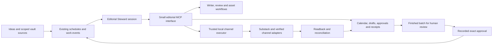

# Persistent editorial operation using the Agents API

Status: researched design, not an activated cloud agent or deployed MCP service. Existing local calendar, approval queue, native Substack schedules and Codex automations remain operational. Verified against official documentation on September 30, 2026.

## What the screen provides

The screenshot shows the Agents API configuration surface. A saved agent defines model, instructions and available tools. A session retains conversation and work and can receive subsequent input. OpenAI manages the Codex harness, orchestration, context compaction and recovery; our application supplies tools and selects the execution environment. A scheduled event can send input to the same session. Persistence does not require continuously generating tokens.

Sources: [Agents API overview](https://developers.openai.com/api/docs/guides/agents-api/overview), [agent configuration](https://developers.openai.com/api/docs/guides/agents-api/configuration), [session continuation](https://developers.openai.com/api/docs/guides/agents-api/sessions).

## Recommended first application

Create one reusable **Editorial Steward** definition with a durable session for the current editorial initiative. Store the agent and session identifiers in the application registry. Give it the existing editorial and Noesis writer instructions and a small allowed tool set. Reading, adaptation, asset requests and review are work stages; add bounded specialist runs only where independent review requires them.

Keep author decisions, calendar slots, payload versions, source provenance, approval evidence, delivery settings and receipts in the existing structured ledger. A session summary can help the agent orient itself, but the ledger decides what is authorized, due, scheduled or already completed. A fresh agent/session must be able to reconstruct the same next action from that ledger.

Your normal interaction becomes: capture an idea or source, receive a finished batch with assets and settings, approve the exact batch, and receive confirmed delivery or an actionable exception. Preparation and follow-up should resume from events without another prompt.

## Reuse before adding infrastructure

| Existing component | Reuse | Small missing connection |
|---|---|---|
| Editorial calendar runner | Source selection, dated tasks, deduplicated discovery and draft enqueue | Expose bounded operations through MCP |
| Private queue, file lock and payload/source/media digests | Authority, claims, deduplication and receipts | Formal native scheduling and scheduled-publication reconciliation transitions |
| Editorial and Noesis writer skills | Brand grounding, prose, claim sheets and review | Versioned skill references in saved agent configuration |
| Imagegen and existing visual assets | Approved covers and source-grounded asset workflow | Asset request/result records; verify image tooling actually available in chosen runtime |
| Weekly and daily Codex automations | Preparation and execution triggers | One event dispatcher; migrate a trigger only after replacement proves equivalent |
| Sunday maintenance job | Bounded health and repair cadence | Structured capability changes rather than repeated unchanged failures |
| Signed-in IAB and installed CLIs | Verified account-specific execution | Tested runtime bridge; cloud Agents API does not automatically inherit Codex IAB sessions |
| Temperance routing and local skills | Existing local execution choices | Keep runtime/provider identity explicit; an OpenAI saved agent does not automatically use OmniRoute combos |

The small missing pieces are a ledger-backed tool interface, event dispatch and tested execution boundaries. A new always-running fleet is unnecessary for the first application.

## MCP contract

Begin with operations that already have safe local equivalents:

- `calendar.next`: returns dated slots, current source hashes and outstanding gates.
- `sources.read_scoped`: reads only authorized roots and canonical files with provenance labels.
- `drafts.list`, `drafts.get`, `drafts.save`: stores complete versioned artifacts and claim sheets.
- `assets.request`, `assets.record`: records a request and validates returned file hashes and accessibility text.
- `queue.inspect`: reports draft, approved, claimed, scheduled, reconciliation and completed states.
- `channels.health`: reports observed identity, capability, freshness and actionable failures separately.
- `publication.request`: requests execution of a ledger item; a trusted executor independently checks direct human approval and all immutable settings.
- `publication.reconcile`: checks an existing external item and records evidence without submitting a replacement.

Do not expose a tool that lets the agent grant itself human approval. Approval is recorded by a trusted user interaction with the exact payload version, account, destination, target when applicable, audience, email setting, assets and date.

The Agents API supports service-origin HTTP MCP, environment-origin HTTP MCP, and stdio in a session environment. For installed local software or private-network services, use a tested self-hosted executor and environment-origin or stdio MCP. A cloud-hosted environment's localhost refers to that environment, not this Mac. Keep credentials in the trusted adapter and expose narrow operations rather than cookie export or arbitrary credential access. [Official MCP connections](https://developers.openai.com/api/docs/guides/agents-api/tools/mcp).

## Durable workflow and events

Proposed states:

`idea → sourced → drafting → reviewed → awaiting_approval → approved → claimed → scheduled → published`

Immediate posts can move from claimed to published after readback. Any uncertain external submission moves to reconciliation; no blind retry or switching transports after a possible submission. Scheduled items remain excluded from due submission and are checked for actual public appearance when their dates arrive.

Useful application events are `source_changed`, `calendar_due`, `approval_recorded`, `channel_health_changed`, and `publication_verified`. Give each event a durable identifier, affected ledger item, source version and handled marker. Coalesce repeated source changes. Allow one active worker claim per item and one controlled event dispatcher per workflow. Store the session identifier and last consumed event identifier so a restart can resume safely.

Existing scheduled jobs can supply the first triggers. Agents API sessions accept input and report asynchronous progress through streaming or webhooks; our application still owns calendar dispatch and business-state transitions. Do not add a second scheduler that can execute the same publication. [Run and continue sessions](https://developers.openai.com/api/docs/guides/agents-api/sessions).

## Current live proof and limits

The approved October Substack batch now has three native article schedules and four native Note schedules, all at 10:00 Europe/Paris. Article delivery is web-only. Existing old drafts were preserved. The local queue records these as scheduled, not published. See [delivery status](substack/2026-10-launch/delivery-status.md) and [receipts](substack/2026-10-launch/publication-receipts.json).

This proves the signed-in IAB scheduling lane in the present Codex runtime. It does not prove that a cloud Agents API session can control that browser, or that every social platform has an authenticated submit adapter. Bird identity remains independently blocked; Glam supplies research/downloads, Arcplume supplies imagery, Reddit account/community readiness remains unresolved, and X Articles capability remains unverified. A persistent agent should prepare useful drafts while holding unavailable channel execution.

## Smallest implementation sequence

1. Formalize scheduled and reconciliation transitions in the existing queue, with replay and duplicate-submission checks. Keep private runtime state outside Git.
2. Add a local MCP interface around existing calendar, source, draft and queue functions. Prove read/draft operations against synthetic data before publication tools.
3. Add a thin durable event dispatcher and agent/session registry. Reuse current schedules initially; never duplicate active triggers.
4. Configure the saved Editorial Steward and validate one read-only planning session in the chosen execution environment. Prove local MCP reachability, scoped source access and artifact return.
5. Demonstrate a full approved draft cycle with one real native schedule and restart/reconciliation evidence. Preserve current IAB execution until a replacement is proven.
6. Apply the same registry, ledger and event pattern to maintenance or other domains with separate tool permissions. Independent responsibilities need separate authority scopes, not an agent with access to every system.

Success means a new source produces a complete reviewable draft and assets; exact approval resumes execution; restarts preserve the next action; repeated events never duplicate a post; expired sessions produce one actionable alert; and changing the model/runtime does not lose business state.

## Maintenance and cost policy

Use event-driven turns with explicit task limits. Keep unchanged checks quiet. Cap routine maintenance at 15 minutes and preserve tested versions and rollback. Route inexpensive deterministic work through existing tools; reserve model calls for research, writing, judgment and review. The Agents API uses API model/tool rates and hosted environments can add container usage; set a budget before activation. No new paid cloud runtime, external access grant or API agent was created during this design pass. [Agents API pricing description](https://developers.openai.com/api/docs/guides/agents-api/overview).
