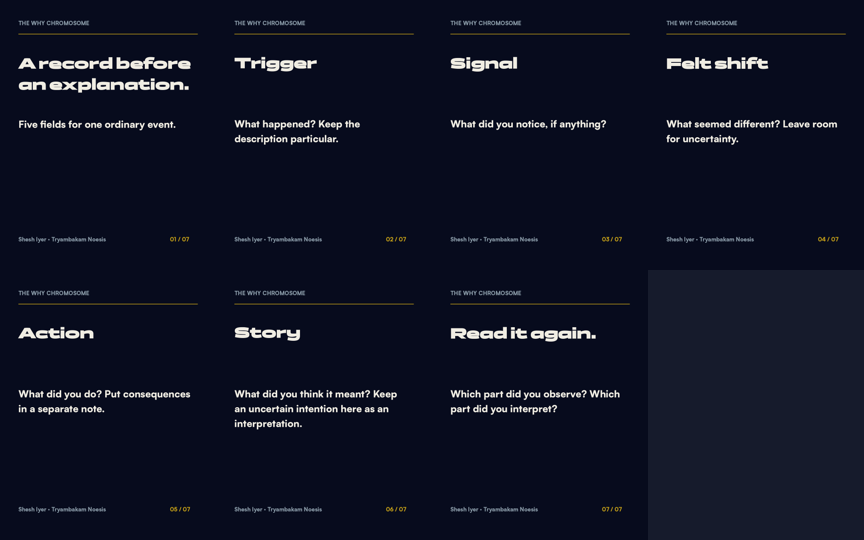

# Personal profile and build-in-public package

> **1 October scope update:** Personal + Thoughtseed + Tryambakam profile reconciliation now lives in [the profile foundation](../../profile-foundation-2026-10-01.md). This README is the September draft snapshot. Current queue and native receipts govern scheduling/publication; frozen manuscripts remain preserved.

September30 review candidate. Status: locally drafted and independently reviewed; no remote account change, private composer save or platform schedule has occurred.

Lead with Shesh Iyer as builder and writer. Tryambakam Noesis names the work; The Why Chromosome names the publication; Synchronocities names the essay/gallery archive. Historical vault marketing proposals remain source context, not current credential or availability claims.

## Review the actual copy

- [Personal and platform profiles](profile-copy.md): X, Instagram, Substack author and Reddit bios; personal About; proposed links.
- [Publication About](publication-about.md): revised The Why Chromosome description.
- [Substack reintroduction](07-substack-reintroduction.md): what is being built and what readers will see.
- [Four X posts](x-posts.json): compact build and essay topics, each under280characters.
- [Instagram carousel and caption](instagram-carousel.md): seven finished PNGs and editable SVG originals.
- [Reddit discussion](reddit-discussion.md): standalone question, disclosed affiliation, hypothetical example; community destination still unset.
- [Activity plan](activity-plan.md) and [exact date proposals](schedule.json).

Existing two essays, four Notes, worksheet and two built-in imagegen covers remain at [October Substack package](../../substack/2026-10-launch/README.md). Those manuscripts were preserved; the new introduction and profile copy supply the wider personal context.

## Draft ledger and scheduling

The private ledger now holds11drafts: the existing6plus this introduction and4Xposts. None is approved. Proposed introduction October1 leaves seven days before the October8 essay; X posts October2/5/7/12, Reddit October9, Instagram October14. All dates10Paris, UTC+02. These are review proposals, not platform schedules. An overdue introduction must be rescheduled coherently, never compressed into the essay cadence.

Instagram and Reddit stay reviewable local packages because this runner does not support their submissions. Weekly preparation and daily approved-item automations now reference this package. Existing Sunday maintenance continues; no additional infrastructure or recurring job was created.

Substack email delivery remains a pending human choice; draft packets use web-only as a conservative placeholder. Approval must specify each exact copy/account/date/audience/email/media. Profile field changes and optional X pinning require their own exact change set. Refresh live identity and duplicate history before any submission. Browser work requires IAB control, which is absent in the current tool inventory.

## Evidence and assets

[Source review](source-review.md) distinguishes historical proposals from current manuscript/runner evidence; [source hashes](source-manifest.json) preserve provenance. [Review](review.json) records independent corrections, content limits and validation. [Asset manifest](asset-manifest.json) contains individual accessible descriptions and PNG hashes. Existing authentic portrait can remain; no generated likeness or unnecessary new banner is proposed.

Local preparation is complete. Live profile readback, private composer creation, selected Reddit community review, exact human approval and verified publication/scheduling remain outstanding.
