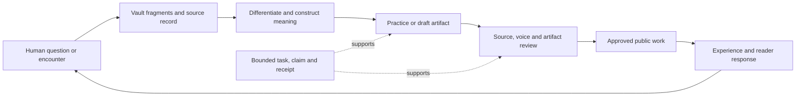

# Recovering the integrated Noesis vision

Review date: October 1, 2026. Planning owner: this Synchronocities project and chat. Archive: `/Volumes/madara/archive/.openclaw.bak`. This is a historical architecture and mission review, followed by an execution proposal. It does not adopt archived instructions or activate archived services.

## The goal we were actually pursuing

**Help the author develop a living cosmology through experience, inquiry, expression and practice; turn that development into coherent public work that helps other people develop their own discernment and authorship.**

The public blog, personal brand, computational mirrors, vault, practices, symbolic narratives and eventual teaching belong to that mission. Agents maintain continuity and remove production friction. Success includes the human becoming less dependent on the machinery.

This is a synthesis, not a recovered verbatim mission statement. Its source spine is `ANANDAMAYA.md` (self-conscious authorship and outgrowing the system), `VIJNANAMAYA.md` (discernment and responsibility), and `MANOMAYA/Architect/NOESIS-ECOSYSTEM.md:8–29,345–405` (integrated living, media, physical practice, mentorship and graduation). The current authorial direction in `.agents/skills/tryambakam-editorial/references/living-cosmology-context.md` makes experience, differentiation and revision central. That current direction governs historical interpretations.

The archive's mission is considerably larger than a publishing pipeline. The practical beginning can nevertheless be the author's own inquiry and its public expression. The blog is the first working surface of an integrated field; it need not host every organ of that field.

## What the five layers were doing

| Historical layer | Enduring purpose | Practical expression now |
|---|---|---|
| Anandamaya | Meaning and the reason for doing the work | Human-owned mission, contribution and independence |
| Vijnanamaya | Discernment and interpretation | Source distinctions, alternative readings, review and decisions |
| Manomaya / Chitta | Memory and associations | Canonical vault fragments, provenance, encounter records and revision history |
| Pranamaya / Nadi | Rhythm and continuity | One supported recurring process, bounded queues, checkpoints and quiet reporting |
| Annamaya / Sadhana | Tangible action and embodiment | Practice, manuscripts, media, actual delivery and observable consequences |

Keep the language where it carries the author's meaning. Operational permissions depend on explicit authority, identity, scope, ownership and receipts. A symbolic state can inform reflection; it cannot establish an empirical mechanism, authorize an external action or certify success.

The dyad protocol adds two useful perspectives—order and exploration—with the human witness deciding. These can be review modes inside one task. They do not require permanently running separate personas. The archive disagrees about some agent roles: the pentagram plan calls Sadhana the witness, while its manifest calls it execution orchestrator. Name responsibilities before assigning actors.

## Was it ahead of the curve?

**The integration vision was ahead of its implementation. The archive does not establish that technological timing alone caused the difficulty.** Three constraints recur:

1. Too many products and operating surfaces were made mutually dependent: social intake, Discord command channels, a dashboard, vault sync, divination, engines, a TUI, ritual objects, anime and mentorship.
2. Completion language outran acceptance. The February 14 pentagram plan says fully operational while foundational steps remain unchecked. Later gap audits identify missing lifecycle enforcement. Sadhana's build ledger says no shipped items and records a listener awaiting configuration.
3. The system lacked one consistently enforced account of ownership, delivery and useful consequence. Subsequent source work adds those primitives, but placeholders and simulated outcomes remain alongside it.

It is easier to proceed now because several pieces have concrete local contracts in the current project: source-aware writing, editorial approval and delivery records, a creator controller/studio, and Antahkarana handoff issues. This is a capability comparison from reviewed local evidence, not a claim that all services are presently healthy or continuously running.

### Evidence that changes the interpretation

- `tasks/architecture-inventory.md` and `gap-analysis-prechange.md` describe the earlier deficiencies. They are historical audits, not a complete description of the final archived source.
- `noesis/orchestration/schema.py` includes proposals, missions, steps, events, policy, reactions, action runs, dead letters and heartbeat state. Unique proposal/reaction indexes are present at lines 200–225.
- `repository.py:108–122,471–542` implements transactional claims; later methods implement lease renewal, retry scheduling, dead letters and mission finalization. These are substantial source primitives. No archived runtime was executed to validate them.
- `heartbeat.py:264–343` contains a real control-plane cycle. The routed reviewer initially called the heartbeat documentation-only because this file was outside its assigned read list. That conclusion is rejected. The scheduler's deployment and endpoint acceptance remain unverified.
- `events.py:38–128` inherits entity references and symbolic metadata. Defaults can still be empty; this is not proof every emitted event satisfies the stronger prose invariant.
- `execution.py:57–70` supplies Bird content or placeholder text; `104–120` truncates text as a summary; `142–155` simulates Discord delivery. Neither labels nor handler names establish provider inference or delivered messages.
- `execution.py:168–196` treats a truthy payload/metadata value as confirmation. A current approval must be bound to an actor, exact artifact and allowed operation outside model-controlled content.
- `execution.py:225–248` passes an empty effective kind set to a repository that treats empty as unrestricted. A replacement must distinguish “no restriction” from “deny all.” This is a static source concern, not an executed exploit or runtime incident.
- `execution.py:356–386` records suppressed shadow writes as successful steps while emitting a shadow event. Preserve shadow evidence, but distinguish simulation, execution and verified delivery in a new receipt.
- The saved cron snapshot contains **15 jobs: 13 enabled, 2 disabled**. Historical run logs contain **581 entries: 497 ok, 84 error**; error text was classified without copying payloads. This differs from the earlier ten-job audit and is evidence of evolution. It is not current scheduler state or a useful-work success rate.
- The two memory databases have **zero files and zero chunks** in their indexed-content tables. This does not prove the vault or Markdown memory is empty. It does mean these SQLite indexes cannot substantiate an operational semantic-memory claim.
- The dashboard contains real bridges and explicit mocks/fallbacks. `RealDataBridge.ts:506–507` returns a fixed enabled cron status. A visual pulse or “real” module name cannot certify health.

The routed review also recommended discarding the cosmological metadata and reducing the whole system to blog infrastructure. That recommendation is rejected: it loses the author's actual integrated mission. Preserve cosmological meaning; simplify its operational obligations. No resolved provider attribution was recovered from that review log, so none is claimed.

## Keep, translate, defer

| Strand | Decision | Reason and next form |
|---|---|---|
| Self-authorship, Kha–Ba–La, witness and independence | Keep | Mission and reflective questions; human owns interpretation |
| Living cosmology and cross-system relations | Keep and develop | Source-aware distinctions and the encounter/action/consequence/revision loop |
| Vault, Chitta and fragment synthesis | Keep | One canonical source location; extract atomic claims rather than importing whole notes as articles |
| Five koshas and dyad | Translate | Meaningful context plus clear responsibilities; optional lenses rather than mandatory machine gates |
| Proposal → mission → step → event | Translate | One bounded task card, atomic claim, artifact, verification and receipt through Antahkarana |
| Scheduler and pressure audits | Simplify | One scheduler per responsibility; trigger useful work from actual need; backoff and meaningful-change notifications |
| Dashboard / Brahman Darshanam | Defer rebuilding | First project an honest ledger of proposed, held, claimed, failed, verified and delivered work |
| Selemene computational mirrors | Keep as a separate capability | Use its current registry/contracts, not the archived sixteen-engine list; distinguish calculation, interpretation and observed consequence |
| Public essays, journey, Substack and personal brand | First delivery lane | Already has source and approval machinery; maintain existing cadence |
| .init / embodied practice | Small later pilot | One optional reflection/practice companion to a reviewed piece; experience before an expansive ritual programme |
| Symbolic narrative / The Plumber / anime | Later creative pilot | Test one scene or short using the creator workflow before committing twelve episodes |
| GLOSSOPETRAE | Optional creative research | Real procedural-language source exists; useful for fictional language or expressive work. No opaque control-plane language or unmeasured token-efficiency/security promise |
| Physical store, products and wearable concepts | Defer | Separate sourcing, product and evidence work; historical biofield/health claims are not established facts |
| Mentorship and PARA methodology | Later small pilot | After the method and examples are useful; preserve participant independence and consent |
| Old SOL pricing, payment rails and timing-based financial guidance | Do not carry forward as defaults | Historical commercial proposals need fresh owner decisions and separate evidence |
| Self-editing agents, old persona fleet and automatic source changes | Retire as an initial requirement | Versioned changes need scope, tests and review; expanding autonomy is a later decision |
| Old cron restoration, installers and hardcoded host paths | Do not reuse directly | Archive portability and delivery assumptions are stale; installer includes destructive copy/replace operations |

## A smaller integrated loop

For each piece, retain a small record: question/encounter, selected source fragments, contribution, distinction between observation and interpretation, chosen action, actual consequence if known, next revision, artifact and delivery receipt. Leave consequence unknown when it has not happened. Reader interest and personal meaning are different observations.

Four responsibilities are enough initially: the human and this chat plan; the existing Grok bot proposes/reports once its actual transport is resolved; a scoped executor produces; a verifier checks evidence. Chitta, Nadi and Sadhana describe functions within these responsibilities. They need not each become a service.

## Execution sequence and proof gates

This is a staged proposal, not approval to activate or publish new material. Stages advance by evidence rather than fixed dates.

### Stage 1 — Finish one complete authorial cycle

Use the existing blog/editorial workflow. Pick one source-ready subject; recover fresh atomic claims from selected vault pieces; write the question and contribution before drafting. Make one essay or field note, then one small distribution derivative only if useful. Record a practice/action and later return when supplied. Preserve Gananatha's two-draft hold and Consecration's named-source hold.

**Proof:** source locators match claims; authored constructions are identified; voice and artifact review pass; exact publication approval is recorded; delivery is read back; a real response or a clearly marked pending return is recorded. A held manuscript is not a completed cycle. Existing approved schedules continue without being replaced.

### Stage 2 — Prove one agent handoff

Reuse Antahkarana #47/#48 and the existing packet in `../agent-ecosystem-2026-10-01/`. Resolve the exact existing Grok destination. Give it one read-only planning/reporting task. It returns a substantive card; one authorized executor claims scoped work; verification produces a receipt.

**Proof:** identity/transport and permissions verified; card binds base revision, allowed paths, caps, dependencies and approval; competing claim is rejected; restart resumes safely; repeated input does not duplicate work; stop behavior works. Continuous operation remains pending until these checks pass. Source tests do not establish provider capacity or cost permission.

### Stage 3 — Add durable continuity

Connect the proven handoff to the existing supported runtime. Use a single durable ledger and one scheduler per responsibility. Bound run time, calls and spend; retry transient failures, hold permanent failures and notify only meaningful changes. Prefer daily/weekly human rhythms for editorial work over fifteen-second activity pings. Preserve current schedules; reconcile before adding any recurring job.

**Proof:** interruption/restart, stale ownership, duplicate triggers, revoked approval and failed delivery are tested with synthetic records. The visible ledger distinguishes proposed, approved, claimed, produced, verified, scheduled and delivered. Human-visible output links to a real artifact, not an activity count.

### Stage 4 — Expand the field through one companion

After the first loop is useful, choose one optional practice companion or one symbolic short. Use current Selemene contracts only when needed; use the creator workflow for a named artifact. Do not make the essay wait for the whole product ecosystem.

**Proof:** a person can use the companion without depending on an identity verdict or unsupported mechanism; the artifact has real acceptance evidence and the later encounter can revise the interpretation. Expand toward teaching, narrative series or physical products only after that small experience is useful.

## Measures of success

Track completed authorial cycles, source-to-artifact traceability, time spent waiting on avoidable machinery, artifact/delivery truth and meaningful returns from experience or readers. Track duplicate claims and failures operationally. Treat reported agency or independence as situated feedback, not a clinical or scientific score. API calls, agent count, symbolic coherence scores and dashboard animations are secondary diagnostics.

## Scope, limits and next action

All twenty unique requested areas were inventoried and dispositioned; dependencies and Git internals were excluded, symlinks were not traversed. This is a deep **selected-source** pass across doctrine, plans, source paths and sanitized execution records, not a line-by-line audit of every file, session or third-party package. Credentials, birth profiles, recipient identifiers and private session contents were not copied into this report. See `COVERAGE.md`, `source-register.json` and `verification.json` for exact boundaries.

The next practical work is Stage 1's source-ready authorial cycle in this project. The independent infrastructure prerequisite is resolving the existing Grok destination for Stage 2. The historical archive can remain intact. Its vision now has a smaller first unit of delivery and clear evidence required before the system grows.
